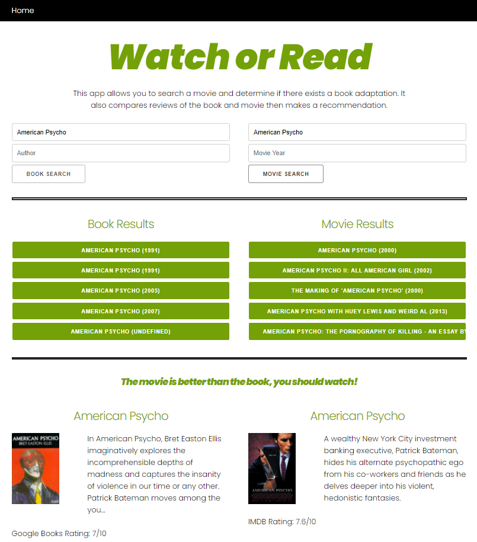

# WatchOrRead

The desired purpose of this deployed application, named "Watch or Read", is to provide valuable information to those deciding whether to watch the movie, read the adapted book, or both.  The information provided to the user includes movie and book descriptions, along with ratings that will assist the user in determining what to watch and/or read.  

## Credits:
The technologies used in the creation of this application are:

* HTML file with a Java Script source link
* CSS style sheet
* Skeleton framework.

The three server-side API's utilized in the application are below:

* [The Open Movie Database](http://www.omdbapi.com/) 
* [Open Library](https://openlibrary.org/developers/api)
* [Google Books](https://books.google.com/books/about/Web_Service_APIs)

## Screenshot:
Below is a screenshot of the deployed "Watch or Read" application:

## URL:
The finished project can be deployed [here](https://breakfastitem.github.io/WatchOrRead/).